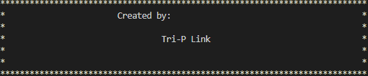
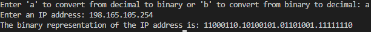
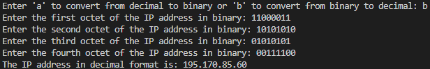

# IP-Converter
* A program that can convert IP addresses inputted by a user between binary and decimal representations from a school project.


## Getting Started
* These instructions will get you a copy of the project up and running on your local machine.

## Prerequisites
* A C compiler (e.g. GCC)

## Installing
> Clone the repository to your local machine.

```
git clone https://github.com/<Vgvg777>/IP-Converter.git
```

> Navigate to the repository directory.

```
cd IP-Converter
```

> Compile the source code.

```
gcc IP-Converter.c -o IP-Converter
```

## Usage
> Run the compiled program.

```
./IP-Converter
```

* Choose between converting from decimal to binary or from binary to decimal by entering 'a' or 'b' respectively.

* Enter the IP address in the appropriate format (decimal or binary).

* The program will output the converted IP address.




# Contributing
> If you would like to contribute to the development of this program, feel free to submit a pull request.
